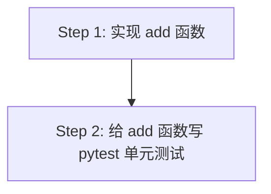

读取计划完成。这是 Python (generic) 项目，两个步骤分别是 `impl` 和 `test`。下面是 orchestrate 结果。

---

# Plan-Orchestrate Result

**Plan**: `docs/demo-plan.md`
**Lang**: `python` (py_sub: `generic`)
**Steps**: 2
**Scope**: all

## Steps overview

| # | Title | Tags | Chain |
|---|---|---|---|
| 1 | 实现 add 函数 | impl | `tdd-guide → python-reviewer` |
| 2 | 给 add 函数写 pytest 单元测试 | test | `tdd-guide → python-reviewer` |

## Parallel execution graph



**Parallel waves** — each wave runs concurrently in separate Claude sessions; wait for the wave to finish before launching the next:

| Wave | Steps | Notes |
|---|---|---|
| 1 | step-1 | no upstream deps |
| 2 | step-2 | depends on step-1 (test references step-1's subject) |

**Dependency sources**:

- step-2 → deps: [step-1] (heuristic: test step references step-1 subject "add 函数 / tools/demo/util.py")

---

## Step 1 — 实现 add 函数

**Intent**: 在 `tools/demo/util.py` 创建并实现 `add(a: int, b: int) -> int` 加法函数；交付物必须可被后续单元测试 import。
**Tags**: impl
**Chain rationale**: 纯实现型步骤；由 `tdd-guide` 先以测试驱动方式落地代码，再由 `python-reviewer` 收尾审查 PEP 8 / 类型注解 / Pythonic 风格（impl 链需以 reviewer-class 收尾）。

### Agents (run sequentially; thread HANDOFF context from prior agent into next)

1.
```
Agent(
  subagent_type="tdd-guide",
  prompt="[Plan: docs/demo-plan.md#step-1] 在 tools/demo/util.py 创建并实现 add(a: int, b: int) -> int 加法函数；先以 pytest 写正常 / 0 / 负数 / 大数场景的失败测试再编写实现，确保后续测试步骤可直接 import。Acceptance: 函数签名严格为 add(a: int, b: int) -> int 且返回两数之和；正数+正数、含 0、负数、大数加法结果均正确；tools/demo/util.py 文件存在且可被 import。End with a HANDOFF block summarizing scope|risks|test plan|next-agent-input."
)
```

2.
```
Agent(
  subagent_type="python-reviewer",
  prompt="[Plan: docs/demo-plan.md#step-1] [Prior HANDOFF from tdd-guide: <pass through>] 审查 tools/demo/util.py 中 add 函数的 Python 风格、类型注解与正确性。Acceptance: 符合 PEP 8 与项目 ruff 配置（E/F/I/B/UP）；类型注解完整且与 add(a: int, b: int) -> int 一致；无反 Pythonic 写法、无隐藏副作用、无对计划之外行为的扩张。End with an updated HANDOFF block."
)
```

---

## Step 2 — 给 add 函数写 pytest 单元测试

**Intent**: 为 Step 1 中 `tools/demo/util.py` 的 `add` 函数编写完整 pytest 单元测试，覆盖率 ≥95%。
**Tags**: test
**Chain rationale**: 测试型步骤；`tdd-guide` 负责按 Acceptance 把用例补齐并验证覆盖率，`python-reviewer` 复核测试质量（命名 / 参数化 / 断言粒度 / 边界覆盖）。test 链由 `tdd-guide` 充当 gate，reviewer 收尾用于把控测试代码风格。

### Agents (run sequentially; thread HANDOFF context from prior agent into next)

1.
```
Agent(
  subagent_type="tdd-guide",
  prompt="[Plan: docs/demo-plan.md#step-2] 为 tools/demo/util.py 的 add 函数编写 pytest 单元测试，落到 tests/demo/test_util.py，并验证覆盖率。Acceptance: pytest 可直接运行 tests/demo/test_util.py；用例数 ≥5，覆盖正数+正数、含 0、负数、边界（含极端正/负值）、大数加法场景；coverage ≥95%；所有用例通过。End with a HANDOFF block summarizing scope|risks|test plan|next-agent-input."
)
```

2.
```
Agent(
  subagent_type="python-reviewer",
  prompt="[Plan: docs/demo-plan.md#step-2] [Prior HANDOFF from tdd-guide: <pass through>] 审查 tests/demo/test_util.py 的 pytest 测试代码质量。Acceptance: 测试命名清晰对应行为；断言精确（避免泛断言）；用 parametrize 合并相似用例减少重复；边界场景被显式覆盖；执行后用例全通过且 coverage 仍 ≥95%。End with an updated HANDOFF block."
)
```

---

> **How to execute this step**: paste the entire step block (header + all N Agent calls) into one Claude session. That session runs the Agent calls in the listed order. For each non-first call, parse the previous agent's HANDOFF block from its tool result and substitute it into the `<pass through>` slot of the next agent's prompt before invoking. Do not parallelize — the chain is sequential by design.

---

**摘要**：共 2 步、2 波。Wave 1 跑 step-1（实现），完成后 Wave 2 跑 step-2（测试）。每步 2 个 Agent 串行 + HANDOFF 串接。Lang 检测为 `python / generic`（`tools/pyproject.toml` 仅含 pytest+ruff，无 torch / django / fastapi）。
