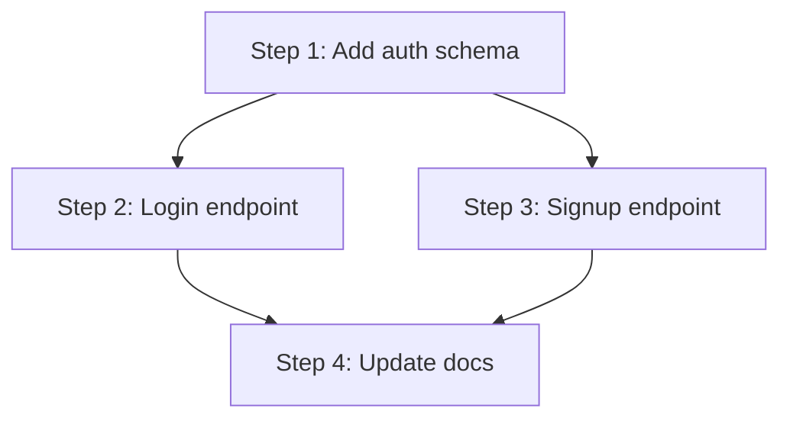

<!-- Local fork: 2026-05-16 — adapted for bare-vendored install (no plugin namespace). Source: ~/.claude/commands/plan-orchestrate.md (user original, 328 lines). Changes: dropped ECC_MODE detection (Phase 0), extended py_sub to {mle,fastapi,generic} (the django path was dropped 2026-07-14 when its reviewer/build-resolver were archived to attic/ — see docs/SELECTION-v1.md), replaced catalogue with v1 keep agents, added debug tag, removed e2e-runner from test chain (E2E → gstack /qa). See README appendix A-H. -->
<!-- 2026-05-17: added Phase 4 "Build parallel-execution DAG" + Mermaid graph + waves table in output; renumbered original Phase 4/5 → 5/6; added "Plan dependency syntax" section. -->

# Plan Orchestrate

Bridge a plan document to native Agent tool invocations by emitting one ready-to-paste block per step (each containing N sequenced Agent calls). The skill is generative only — it never invokes the Agent tool. **Consumption model**: the user pastes the **entire step block** as one unit into a Claude session; that session then executes all N Agent calls in order and threads HANDOFF context from each agent into the next. Per-Agent-block manual pasting is not the intended workflow.

## When to Activate

- User has a multi-step plan document (PRD, RFC, implementation plan) and wants to drive it through sequenced Agent calls.
- User says "orchestrate this plan", "give me Agent blocks for each step", "compose agent chains for this plan".
- A step-by-step plan exists but the user does not want to manually pick agents per step.

Skip when:
- The work is one ad-hoc step → call the Agent tool directly.
- The plan is unreadable or empty. Lack of explicit numbering alone is not a skip condition — see the "No clear steps" edge case below.

## Inputs

```
<plan-doc-path> [--lang=python|typescript|swift|rust|auto] [--scope=all|step:<n>|range:<a>-<b>] [--dry-run]
```

- `<plan-doc-path>` — required; relative or absolute path (`@docs/...` accepted).
- `--lang` — reviewer language variant; defaults to `auto` (detected from project).
- `--scope` — limits emitted steps; defaults to `all`.
- `--dry-run` — print decomposition + chain rationale only; do not emit final prompts.

A **parallel-execution graph** (Mermaid `flowchart TD` + waves table) is always emitted after the overview table — see Phase 4 (build) and Phase 5 (render). It identifies which steps can be launched concurrently in separate Claude sessions. Even under `--dry-run` the graph is included.

## Plan dependency syntax (optional)

Plan authors can declare step-to-step dependencies anywhere inside a step's body; this skill parses them to build the parallel-execution DAG. Declarations are case-insensitive; both English and Chinese forms are recognized.

| Intent | Recognized forms |
|---|---|
| Blocking dependency | `depends on: step-N` / `depends on step N` / `requires step N` / `after step N` / `blocked by step N` / `在 step N 之后` / `依赖 step N` |
| Multiple upstream deps | Comma- or `+`-separated list, e.g. `depends on: step-2, step-3` or `requires step-2 + step-4` |
| Explicit independence | `independent` / `parallel ok` / `no dependencies` / `独立` / `可并行` |
| Pairwise parallel hint | `can run in parallel with step N` / `与 step N 并行` (informational; same effect as both steps being independent of each other) |

Declarations beat heuristics: an explicit `independent` clears any heuristic edges the skill would otherwise add to that step. If declarations form a cycle, the skill emits the graph with the cycle flagged and asks the user to resolve it in the plan.

## Authoritative emission shape (do not deviate)

```
Agent(
  subagent_type="<bare-agent-name>",
  prompt="<single-line task description with embedded \" escaped>"
)
```

Each Agent block represents one agent. A sequential chain of N agents emits as N Agent blocks in order — the executing session runs them sequentially and threads HANDOFF context from prior to next.

- One Agent block per agent. No comma-list semantics; no `custom` keyword; no `--mode` / `--gate` / `--agents=...` flags — never invent them.
- The only fields emitted are `subagent_type` and `prompt`. Do not emit `description`, `model`, `isolation`, or any other Agent tool field — keep the output minimal and unambiguous.
- Agent names come from the catalogue in this skill. **Always bare names**, never prefixed. This repo installs agents at `~/.claude/agents/<name>.md` via symlink — there is no plugin namespace to prefix.
- `prompt` is a single-line double-quoted string. Embedded double quotes are escaped as `\"`. No literal newlines inside the string.

## HANDOFF block format (required — orchestrator contract)

The `tools/orchestrator.py` harness extracts HANDOFF context by regex-scanning each agent's transcript for a literal `<handoff>...</handoff>` block whose inner content is a **single valid JSON object**. A markdown-style summary (headings like "Scope" / "Risks", or a `scope|risks|...` pipe list) is NOT extractable: the extractor falls back to a placeholder and the chain silently degrades to a sequential single-agent run. Therefore every emitted prompt MUST instruct the agent to end with the tagged-JSON form — never prose, never markdown headings.

Required shape (the literal `<handoff>` / `</handoff>` tags are mandatory): `<handoff>{"scope":"…","risks":["…"],"test-plan":"…","next-agent-input":"…"}</handoff>`

JSON keys (all required; mirror `tools/HANDOFF.schema.json`):
- `scope` (string) — what this agent was asked to do, one sentence.
- `risks` (array of strings) — caveats the next agent must know.
- `test-plan` (string) — how the agent verified its output (tests run, coverage, manual checks).
- `next-agent-input` (string) — concrete context the next agent needs (files changed, exported symbols, known issues).

Standard prompt-tail directives — append verbatim to each agent's prompt (single-line; escape `"` as `\"`):
- First agent: `End with a literal <handoff>{...}</handoff> block — a single JSON object with keys scope, risks (array of strings), test-plan, next-agent-input. The <handoff></handoff> tags are mandatory; do NOT use markdown headings or a pipe list.`
- Non-first agent: `End with an updated <handoff>{...}</handoff> block (same JSON keys: scope, risks, test-plan, next-agent-input; literal tags mandatory).`
- Final agent: `End with a final <handoff>{...}</handoff> block (same JSON keys; literal tags mandatory).`

## Available agent catalogue (must pick from these)

Implementation / planning / refactor:
- `planner` — requirement restatement, risk decomposition, step planning
- `code-architect` — feature architecture, blueprints, build order
- `code-explorer` — read-only deep dive into existing code paths
- `tdd-guide` — write tests → implement → 80%+ coverage
- `refactor-cleaner` — dead code, duplicates, knip-class cleanup
- `code-simplifier` — clarity, consistency, behavior-preserving refactor

Review:
- `code-reviewer` — generic code review (fallback when no lang reviewer)
- `security-reviewer` — security audit, OWASP, secret leakage
- `database-reviewer` — PostgreSQL schema, migration, performance
- `pr-test-analyzer` — PR test coverage quality

Special angles:
- `silent-failure-hunter` — swallowed errors, bad fallbacks, missing propagation
- `performance-optimizer` — bottlenecks, memory, render, algorithmic
- `a11y-architect` — WCAG 2.2 / inclusive UX
- `build-error-resolver` (generic fallback)

Framework-specific reviewers + build resolvers:
- `fastapi-reviewer`
- `mle-reviewer` / `pytorch-build-resolver` — ML/training/inference pipelines

Language-specific reviewers + build resolvers:
- `python-reviewer`
- `typescript-reviewer`
- `swift-reviewer` / `swift-build-resolver`

Tools / workflow:
- `loop-operator` — long-running autonomous loops
- `harness-optimizer` — local agent harness configuration

Docs:
- `doc-updater` — documentation, codemap, README
- `docs-lookup` — third-party library API lookups (Context7)

A misspelled agent name fails the Agent tool with `InputValidationError`. Cross-check against this list before emitting. **Not in this catalogue** (do not emit): `architect` (use `code-architect`), `e2e-runner` (E2E goes through gstack `/qa`), `chief-of-staff`, `django-reviewer` / `django-build-resolver`, `rust-reviewer` / `rust-build-resolver` (archived to `attic/` — see `docs/SELECTION-v1.md`), `cpp-*` / `go-*` / `java-*` / `kotlin-*` / `flutter-*` reviewers and build resolvers (those languages are out of v1 scope).

## How It Works

### Phase 0 — Detect language + framework

1. Read `<plan-doc-path>`. If missing or empty, report and stop.
2. **Normalize any agent names declared in the plan**: if the plan text references agents by any prefixed form (e.g. `ecc:tdd-guide` or `everything-claude-code:tdd-guide`), strip the prefix to get the bare catalogue name before validating or composing chains. This repo always emits bare names.
3. Resolve `--lang`. When `auto`, run polyglot-aware detection:
   - Probe markers: `pyproject.toml` / `uv.lock` / `requirements.txt` → python; `package.json` → typescript; `Cargo.toml` → rust; `Package.swift` or top-level `*.swift` → swift.
   - **Polyglot tie-break**: if more than one marker matches, pick the language whose source files outnumber the others (count via `git ls-files`, excluding `vendor/`, `node_modules/`, `dist/`, `build/`, `.venv/`, generated files, and obvious test fixtures). On a tie or when no language exceeds 60% of source files, set `lang=unknown`.
   - No marker matched → set `lang=unknown`.
   - `lang=unknown` is a sentinel — it is **not** an agent name. Phase 2 composition rules turn it into `code-reviewer` / `build-error-resolver` at chain composition time.
4. **Detect Python sub-profile** when `lang=python`. Set `py_sub` to one of `{mle, fastapi, generic}` using the first match below:
   - `mle`: `pyproject.toml` / `requirements.txt` / `uv.lock` declares `torch` OR plan text contains `pytorch`, `training`, `dataloader`, `fine-tune`, `lora`. Reviewer: `mle-reviewer`. Build resolver: `pytorch-build-resolver`.
   - `fastapi`: `fastapi` is a declared dep, OR plan text contains `fastapi`, `pydantic`, `asgi`. Reviewer: `fastapi-reviewer`. Build resolver: `build-error-resolver` (no fastapi-build-resolver in v1).
   - `generic` (default; also covers Django and any other framework with no dedicated agent in v1 — `django-reviewer`/`django-build-resolver` were archived, see catalogue exclusions): no ML or FastAPI signal detected. Reviewer: `python-reviewer`. Build resolver: `build-error-resolver`.

### Phase 1 — Decompose steps

Identify "step units" in priority order:

1. Explicit numbering: `## Step N` / `### Phase N` / `## N. ...` / top-level ordered list.
2. A "Step" column in a table.
3. `---`-separated blocks with verb-led headings.
4. Otherwise treat each H2 as one step.

Per step extract `id` (1-based), `title` (≤ 80 chars), `intent` (1–3 sentences), `tags`.

### Phase 2 — Tag and pick chain

Tag by intent (multi-tag allowed; chain built from primary + stacked secondaries):

Trigger words below are matched case-insensitively. Multilingual plans are supported by matching the word stems in any language as long as the meaning aligns with the listed English trigger words.

| Tag | Trigger words | Default chain |
|---|---|---|
| `design` | architecture, design, choose, evaluate, RFC | `code-explorer,planner,code-architect` |
| `plan` | plan, breakdown, milestone | `planner` |
| `impl` | implement, build, add, create, port | `tdd-guide,<lang>-reviewer` |
| `test` | test, coverage, unit, integration | `tdd-guide,<lang>-reviewer` |
| `debug` | error swallow, fallback, silently, handle error, lost error | `silent-failure-hunter,<lang>-reviewer` |
| `refactor` | refactor, cleanup, dedupe, split | `code-architect,refactor-cleaner,<lang>-reviewer` |
| `migration` | migrate, upgrade, rewrite, port | `code-explorer,code-architect,tdd-guide,<lang>-reviewer` |
| `db` | schema, migration, index, SQL, Postgres, alembic, sqlmodel | `database-reviewer,<lang>-reviewer` |
| `security` | encrypt, auth, secret, OWASP, PII | `security-reviewer,<lang>-reviewer` |
| `build` | build, compile, lint failure, CI | `<lang>-build-resolver` (falls back to `build-error-resolver`) |
| `docs` | docs, readme, codemap, changelog | `doc-updater` |
| `lookup` | lookup, reference, API usage | `docs-lookup` |
| `review` | review, audit, verify | `<lang>-reviewer,code-reviewer` |
| `loop` | loop, autonomous, watchdog | `loop-operator` |

> **E2E is not in this table.** v1 routes end-to-end work, browser automation, and visual QA to gstack `/qa` / `/browse` / `/design-review` (independent skill set). When a step is plain E2E, suggest the user invoke gstack `/qa` directly instead of composing a chain.

Chain composition rules:

1. **Primary tag selection**: when a step matches multiple tags, the **first one in table order** (top of the table = highest priority) is the primary; the rest are secondaries.
2. `impl` + `security` → `tdd-guide,<lang>-reviewer,security-reviewer`.
3. `impl` + `db` → `tdd-guide,database-reviewer,<lang>-reviewer`.
4. **Deduplicate** the resulting chain (preserve first occurrence).
5. **`<lang>-reviewer` resolution**:
   - `lang=python` → check `py_sub` (Phase 0 step 4):
     - `py_sub=mle` → `mle-reviewer`
     - `py_sub=fastapi` → `fastapi-reviewer`
     - `py_sub=generic` → `python-reviewer`
   - `lang=typescript` → `typescript-reviewer`
   - `lang=swift` → `swift-reviewer`
   - `lang=rust` → `code-reviewer` (no rust-reviewer vendored in v1 — see catalogue exclusions)
   - `lang=unknown` → `code-reviewer`
6. **`<lang>-build-resolver` resolution**:
   - `lang=python` → check `py_sub`:
     - `py_sub=mle` → `pytorch-build-resolver`
     - `py_sub=fastapi` or `py_sub=generic` → `build-error-resolver`
   - `lang=swift` → `swift-build-resolver`
   - `lang=rust` → `build-error-resolver` (no rust-build-resolver vendored in v1 — see catalogue exclusions)
   - `lang=typescript` or `lang=unknown` → `build-error-resolver`
7. **Zero-tag steps**: if no trigger word matches, set chain to `code-reviewer` and write `no tag matched; default review-only chain` under "Chain rationale".
8. Chain length ≤ 4 after deduplication. If exceeded, drop weakest tag (`lookup` and `docs` first).
9. Do not pair `planner` and `code-architect` in an `impl` chain (token waste). Pair them only on `design` steps.
10. Steps tagged `impl`, `refactor`, or `migration` end with a **reviewer-class** agent — any of `<lang>-reviewer`, `code-reviewer`, `security-reviewer`, or `database-reviewer`. The most domain-specific reviewer wins the tail position. `test`, `build`, `debug` are gated by their own validators (tdd-guide / build resolver / silent-failure-hunter) and do not require an additional reviewer-class tail.

### Phase 3 — Compress task description

Each emitted `<task description>` must:

- Be self-contained (the first agent does not need the plan document open).
- Start with `[Plan: <path>#step-<id>]`.
- Include 1–3 verifiable Acceptance criteria.
- Include a Scope guard (`Out of scope: ...`) **only if the plan declares one for this step**. Inherit verbatim. If the plan has no out-of-scope statement, omit the clause entirely — do not invent one.
- Be 200–600 characters; one line; embedded `"` escaped as `\"`; no literal newlines.

### Phase 4 — Build parallel-execution DAG

For each step, compute its dependency set `deps` (the set of upstream steps that must finish before this step starts). Run in this order:

1. **Explicit declarations win.** Parse every form listed in "Plan dependency syntax". An `independent` declaration clears all heuristic edges that would otherwise be added to that step. Record the matched phrase verbatim (used later as the `explicit:<phrase>` annotation).
2. **Heuristic edges** (only added when no explicit declaration covers the same edge):
   - `design` / `plan` tag → depends on the nearest earlier `design`/`plan` step, or none if it is the first such step.
   - `db` schema change → no upstream dep by default; downstream `impl` / `migration` / `test` steps that mention the same entity (table name, model name, schema name) in their title or intent gain an edge to it.
   - `impl` / `refactor` / `migration` → if `--lang` is detected and a same-area cue is present (shared file path, shared module, or shared entity name with an earlier `impl`/`refactor`/`migration` step), inherit that edge; otherwise no heuristic upstream dep.
   - `test` tag whose title/intent references another step's subject → depends on that step. If no reference, no heuristic dep.
   - `build` tag → depends on every preceding `impl` / `refactor` / `migration` step in scope.
   - `docs` tag → depends on every preceding non-`docs` step (docs are written last).
   - `security` review-style step (no `impl` of its own) → depends on every preceding step it audits, identified by shared entity mentions.
3. **Conservative fallback**: a step with **neither explicit nor heuristic deps** stays at `deps = ∅` (independent). Do **not** auto-chain to the previous step — that would defeat the graph. If the author wants strict order, they should add `depends on: step-N`.
4. **Transitive reduction**: drop edges that are implied by a longer path (e.g. if `step-3 → step-1` and `step-3 → step-2` and `step-2 → step-1`, drop the `3→1` Mermaid edge for clarity). The underlying `deps` set is preserved internally; only the rendered graph is reduced.
5. **Cycle detection**: run a topo sort. If a cycle is found, emit the graph with the offending edges labelled `⚠️ cycle`, list cycle members under the graph, compute waves on the acyclic subset only, and tag the cycle members as `unscheduled` in the waves table.
6. **Waves (Kahn's algorithm)**: `Wave 1` = all steps with `deps = ∅`. Remove them, recompute, `Wave 2` = newly-zero-in-degree steps. Repeat until every (acyclic) step is assigned. Steps in the same wave can be launched concurrently in separate Claude sessions; the next wave starts only after the current wave finishes.

### Phase 5 — Output

Emit Markdown using **bare agent names**. Every `subagent_type` value is the unprefixed catalogue name.

Output structure:

`````markdown
# Plan-Orchestrate Result

**Plan**: `<path>`
**Lang**: `<detected-or-given>` (py_sub: `<mle|fastapi|generic>` when lang=python)
**Steps**: <N>
**Scope**: <all | step:n | range:a-b>

## Steps overview

| # | Title | Tags | Chain |
|---|---|---|---|
| 1 | ... | impl, db | `tdd-guide → database-reviewer → swift-reviewer` |
| ... | | | |

## Parallel execution graph



**Parallel waves** — each wave runs concurrently in separate Claude sessions; wait for the wave to finish before launching the next:

| Wave | Steps | Notes |
|---|---|---|
| 1 | step-1 | no upstream deps |
| 2 | step-2, step-3 | both depend only on step-1; independent of each other |
| 3 | step-4 | docs; waits for all preceding non-docs steps |

**Dependency sources** — for every non-root step, list its `deps` and how each edge was derived (`explicit:"<phrase>"` quoting the plan, or `heuristic:<rule>`):

- step-2 → deps: [step-1] (explicit: "depends on: step-1")
- step-3 → deps: [step-1] (heuristic: shared entity "UserSession" with step-1)
- step-4 → deps: [step-2, step-3] (heuristic: docs after non-docs)

If a cycle was detected, add a `⚠️ Cycle:` line listing the members and the disagreeing edges; do not silently drop them.

---

## Step 1 — <title>

**Intent**: <1–3 sentences>
**Tags**: <a, b>
**Chain rationale**: <why this chain; which agent closes the loop>

### Agents (run sequentially; thread HANDOFF context from prior agent into next)

1.
```
Agent(
  subagent_type="tdd-guide",
  prompt="[Plan: docs/foo.md#step-1] <compressed task description>; Acceptance: <1–3 items>; Out of scope: <…>; End with a literal <handoff>{...}</handoff> block — a single JSON object with keys scope, risks (array of strings), test-plan, next-agent-input. The <handoff></handoff> tags are mandatory; do NOT use markdown headings or a pipe list."
)
```

2.
```
Agent(
  subagent_type="database-reviewer",
  prompt="[Plan: docs/foo.md#step-1] [Prior HANDOFF from tdd-guide: <pass through>] <compressed task description from the reviewer's lens>; Acceptance: <1–3 items>; End with an updated <handoff>{...}</handoff> block (same JSON keys: scope, risks, test-plan, next-agent-input; literal tags mandatory)."
)
```

3.
```
Agent(
  subagent_type="swift-reviewer",
  prompt="[Plan: docs/foo.md#step-1] [Prior HANDOFF from database-reviewer: <pass through>] <reviewer task>; Acceptance: <1–3 items>; End with a final <handoff>{...}</handoff> block (same JSON keys; literal tags mandatory)."
)
```
`````

After the last step block, append this verbatim execution note. It addresses **the LLM session that will execute the step**, not the human user:

> **How to execute this step**: paste the entire step block (header + all N Agent calls) into one Claude session. That session runs the Agent calls in the listed order. For each non-first call, parse the previous agent's HANDOFF block from its tool result and substitute it into the `<pass through>` slot of the next agent's prompt before invoking. Do not parallelize — the chain is sequential by design.

No "Batch execution" block — each step block already is its own paste unit; cross-step batching would make HANDOFF threading impossible to follow. Cross-step concurrency is expressed through the parallel-execution graph (waves), not through batched Agent calls.

### Phase 6 — Self-check (run before emitting)

- [ ] Every emitted `subagent_type` value comes from the catalogue (after normalizing any prefixed form stripped in Phase 0 step 2).
- [ ] Every `subagent_type` is **bare** (no `ecc:` prefix, no `everything-claude-code:` prefix). This repo's install is bare-symlink only.
- [ ] No invented `--mode` / `--gate` / `--agents=...` fields, and no Agent tool arguments other than `subagent_type` and `prompt`.
- [ ] Each Agent block's `prompt` is a single-line double-quoted string with embedded `"` escaped as `\"` and no literal newlines.
- [ ] Each prompt begins with `[Plan: <path>#step-<id>]` and includes Acceptance (1–3 items). The `Out of scope:` clause is present only when inherited from the plan.
- [ ] First agent in a chain ends its prompt with the literal-`<handoff>{...}</handoff>`-JSON directive (keys: scope, risks[], test-plan, next-agent-input) — see "HANDOFF block format". Never a markdown summary or pipe list.
- [ ] Each non-first agent's prompt opens with `[Prior HANDOFF from <prev-agent>: <pass through>]`.
- [ ] No duplicate agent in any chain after Phase 2 dedup.
- [ ] Chain length ≤ 4 ⇒ ≤ 4 Agent blocks per step.
- [ ] Steps tagged `impl`/`refactor`/`migration` end with a reviewer-class agent. `test`/`build`/`debug` are exempt — see Phase 2 rule 10.
- [ ] Zero-tag steps emit a single `code-reviewer` Agent block with the rationale `no tag matched; default review-only chain`.
- [ ] Overview table lists every step in the plan, regardless of `--scope`.
- [ ] Per-step block count matches the resolved `--scope` (full plan when `--scope=all`; one block for `step:n`; range size for `range:a-b`). In overview-only mode, no per-step blocks emitted.
- [ ] No "Batch execution" block present.
- [ ] Parallel-execution graph section is present immediately after the overview table, regardless of `--scope` or `--dry-run`.
- [ ] Mermaid block opens with ```` ```mermaid ```` and `flowchart TD`; every node id starts with `S` followed by the step number; every edge uses `-->`; node labels in double quotes; no unmatched quotes or stray newlines inside labels.
- [ ] Waves table includes every step from the plan; each step appears in exactly one wave OR is marked `unscheduled` because it sits in a cycle.
- [ ] Every non-root step has an annotated `deps` line tagged either `explicit:"<phrase>"` (verbatim from the plan) or `heuristic:<rule>`.
- [ ] If a cycle was detected, both the Mermaid graph (`⚠️ cycle` edges) and the waves table (`⚠️ Cycle:` line, cycle members listed) call it out; no silent omission.
- [ ] Transitive-reduction applied to rendered edges — no edge `A→C` is drawn if there is already a path `A→B→C` in the graph.

## Edge cases

- **No clear steps**: prefer H2/H3 splitting; if still ambiguous, report "no structured steps detected" with the document outline and ask the user to confirm running by outline.
- **Large plan (>1500 lines)**: enter **overview-only mode** — emit only the overview table and ask the user to narrow with `--scope` before re-running for details.
- **Step too broad** (e.g. "complete all backend work"): do not force a single chain. Suggest splitting into N.a and N.b and propose a split.
- **Plan declares agents** (rare): first strip any prefix to get the bare catalogue name, then validate against the catalogue. Replace invalid agents and explain under "Chain rationale".
- **Polyglot project where `--lang=auto` cannot pick a winner**: set `lang=unknown`; reviewer resolves to `code-reviewer` and build resolver to `build-error-resolver`. Mention the fallback under "Chain rationale".
- **E2E or visual QA step**: do NOT compose a chain. Instead recommend the user invoke gstack `/qa` / `/browse` / `/design-review` directly. These are independent skills handled outside this catalogue.

## Example — Swift impl + db step

Input:

```
plan-orchestrate @docs/plan/profile-sync.md --lang=swift
```

Excerpt of expected output:

`````markdown
## Step 3 — Add encrypted local store for UserProfile

**Intent**: Introduce a CoreData backing store for `UserProfile` with field-level encryption for `birthDate` and `location`; migration from the current `UserDefaults` path.
**Tags**: impl, db, security
**Chain rationale**: Security-sensitive write path → `security-reviewer` closes the chain; `database-reviewer` validates the migration; `swift-reviewer` covers Swift idioms (actor isolation, value semantics).

### Agents (run sequentially; thread HANDOFF context from prior agent into next)

1.
```
Agent(
  subagent_type="tdd-guide",
  prompt="[Plan: docs/plan/profile-sync.md#step-3] Implement encrypted CoreData store for UserProfile with field-level AES-GCM encryption for birthDate and location; migration from UserDefaults; key from Keychain. Acceptance: encrypt/decrypt roundtrip XCTests pass; migration is idempotent and downgrade-safe; no plaintext in the SQLite file after migration. Out of scope: server-side sync conflicts. End with a literal <handoff>{...}</handoff> block — a single JSON object with keys scope, risks (array of strings), test-plan, next-agent-input. The <handoff></handoff> tags are mandatory; do NOT use markdown headings or a pipe list."
)
```

2.
```
Agent(
  subagent_type="database-reviewer",
  prompt="[Plan: docs/plan/profile-sync.md#step-3] [Prior HANDOFF from tdd-guide: <pass through>] Review CoreData migration safety on production schema; Acceptance: migration is idempotent; downgrade leaves no orphan columns; encryption-at-rest preserved across migration; End with an updated <handoff>{...}</handoff> block (same JSON keys: scope, risks, test-plan, next-agent-input; literal tags mandatory)."
)
```

3.
```
Agent(
  subagent_type="swift-reviewer",
  prompt="[Plan: docs/plan/profile-sync.md#step-3] [Prior HANDOFF from database-reviewer: <pass through>] Review the Swift implementation for actor isolation, value semantics, and Swift Concurrency 6.2 idioms; Acceptance: no data races flagged by strict concurrency checker; encryption type is Sendable; descriptors documented; End with an updated <handoff>{...}</handoff> block (same JSON keys: scope, risks, test-plan, next-agent-input; literal tags mandatory)."
)
```

4.
```
Agent(
  subagent_type="security-reviewer",
  prompt="[Plan: docs/plan/profile-sync.md#step-3] [Prior HANDOFF from swift-reviewer: <pass through>] Security audit of the encryption flow; Acceptance: key never logged or serialized; AES-GCM nonce uniqueness verified across migration; key rotation path documented; End with a final <handoff>{...}</handoff> block (same JSON keys; literal tags mandatory)."
)
```
`````

## Notes

- Generative only. Never invoke the Agent tool from inside this skill; emit blocks for the user (or a downstream session) to execute.
- Match the language of the plan document for task descriptions (agent names always remain English).
- Do not insert "Co-Authored-By" lines or emoji in the output unless the user explicitly asks.
- **E2E / visual QA**: covered by `test` chain only for unit/integration review work. Plain E2E user-flow tests, browser automation, and visual design QA go through gstack `/qa` / `/browse` / `/design-review` (independent skill set, not in this catalogue).
- **Parallel-execution graph**: derived from explicit `depends on` declarations + tag/entity heuristics. The Mermaid block renders directly in GitHub, Claude Code UI, and most Markdown viewers; the waves table is the executable companion (one wave = one round of concurrent Claude sessions). Cross-step concurrency lives in the graph; cross-agent intra-step sequencing lives in HANDOFF threading. Do not conflate the two.

## Arguments

`$ARGUMENTS`

Per the "Inputs" section above:

- `<plan-doc-path>` — required
- `--lang=<...>` — optional
- `--scope=<...>` — optional
- `--dry-run` — optional
